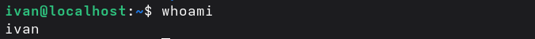
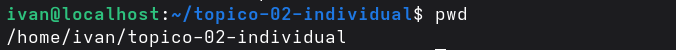
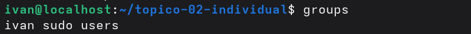
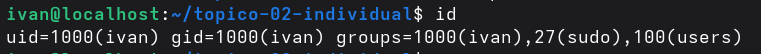

# Permissões aplicadas
## Ambiente utilizado
VPS Linode

## Utilizadores e grupos
**whoami** mostra o respetivo utilizador que esta logado ou que acessou a conta.

**pwd** apresenta o caminho do directorio onde se encontra.

**groups** mostra os respetivos grupos de utilizadores existentes no sistema.

**id** apresenta como resultado o id do utilizador a que o respetivo utilizador faz parte.

## Permissões aplicadas
| Ficheiro | Permissão | Justificação |
| publico.txt | 644 | Foi aplicado esta permissao com o objetivo de manter o previlegio de edicao no user e de leitura no grupo e outros |
| restrito.txt | 640 | Restringiu-se o acesso ao ficheiro atribuindo o previlegio de leitura para o grupo e leitura e escrita para o users e nenhum para os outros. |
| script.sh | u+x | Atribui-se a permissao de execucao do ficheiro *script.sh* para o user |

## Relação com o princípio do menor privilégio

As permissoes aplicadas sao as mais adequadas porque se atribuimos permissoes totais a todos os utilizadores teriamos um caos total. 
Pois, todos fariam o que bem com os ficheiros o que poderia afetar o seu proprio controle e os ficheiros levariam a possibilidade de qualquer 
mudanca seja feita e aceite por cada utilizador de forma autonoma.
